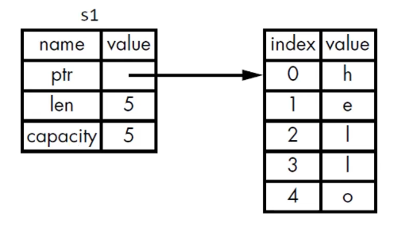
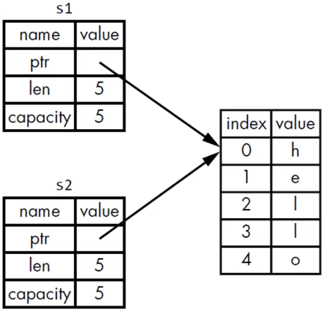
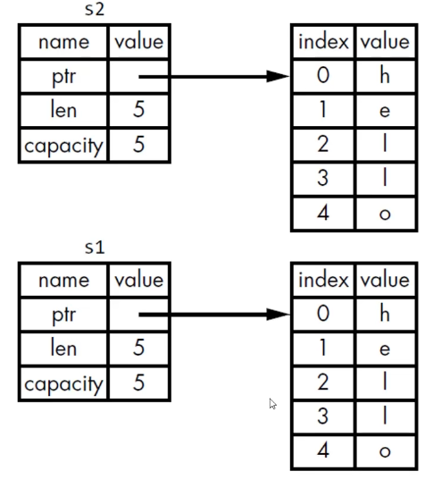
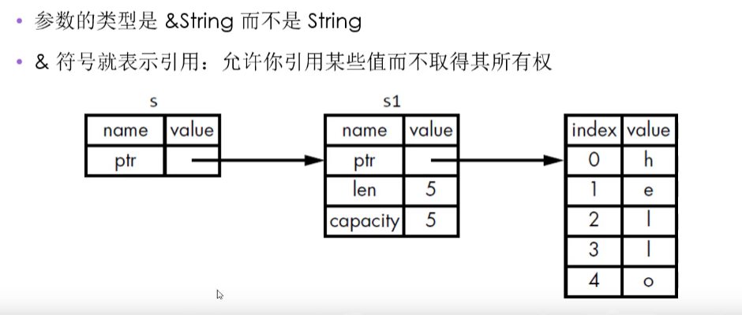

# RustProject
Rust学习项目

开发工具：vscode
添加插件：rust-analyzer,Toml Language Support,crates

## Day1
安装： 官网下载
通过vsstudio 安装c++环境

rust程序后缀名 .rs

文件命名规范： hello_world.rs

- 更新rust `rustup update`
- 卸载rust `rustup self uninstall`
- 安装验证  `rustc --version`
- 查看本地文档 `rustup doc`
- 编译 `rustc main.rs`
- 查看cargo版本 `cargo --version`
- cargo创建项目 `cargo new projectname`
- cargo编译项目 `cargo build`
  - 创建可执行文件 `target\debug\hello_cargo.exe`
- 编译代码 + 执行结果 `cargo run`
  - 如果上次编译后代码没有被修改过 不会再次编译
- 检查代码 `cargo check` 确保能够通过编译,比`cargo build`快得多
- 发布 `cargo build --release` 编译时会进行优化 会在`target/release`下生成可执行文件

cargo.toml
- pacakge 是一个区域标题 表示配置当前包的
  - name 项目名
  - version 项目版本
  - authors 项目作者
  - edition 使用的rust版本
- dependencies 另一个区域的开始 配置依赖项的地方

新学习到的代码
```rust
    println!("打印一行字")
    // 读取一行字  mut 标识变量 不加mut表示常量不可被修改
    use std::io;
    let mut guess = String::new();
    // expect 类似catch  read_line会返回一个result 如果是err 则运行中断程序并循行 expect
    io::stdin()::read_line(&mut guess).expect("无法读取行");

    // 获取随机数
    use rand::Rng;
    let secret_number = rand::thread_rng().gen_range(1..100);
    println!("神秘数字是{}", secret_number);

    // rust 允许重名变量  后面赋值的会把前面的覆盖掉  parse() 会把字符串解析成数字
    let guess: u32 = guess.trim().parse().expect("Please type a number");
    // try catch 写法
    let guess: u32 = match guess.trim().parse() {
            Ok(num) => num,
            Err(_) => continue,
    };
```

## Day2 变量-标量-复合类型

路径 ./variables/

### 代码演示
```rust
const MAX_POINTS: u32 = 100_000;
fn main() {
    // 变量与可变性
    // var()
    // 标量类型
    // biao_linag()
    // 复合类型
    fu_he();
}

fn fu_he() {
    // rust 有两种复合类型 一种是元组(Tuple) 一种是数组
    // Tuple 可以将多个类型的多个值放到一个类型里 长度是固定的一旦被声明将无法更改
    // Tuple 中每个位置对应一个类型  各元素类型不必相同
    let tup: (i32, f64, u8) = (500, 6.4, 1);
    print!("{},{},{}", tup.0, tup.1, tup.2);
    // 解构
    let (x, y, z) = tup;
    println!("{},{},{}", x, y, z);
    // 数组 可以将多个值放到一个类型里，且每个元素的类型必须相同  数组的长度也是固定的
    let a = [1, 2, 3, 4, 5];
    // 如果想让数组存到stack（栈） 上而不是heap（堆）上，或者想保证固定数量的元素，这时使用数组更有好处
    // 数组没有Vector灵活 Vector 长度可以改变
    // 如果数组中每个元素都相等可以下面这样声明
    let b = [5; 5];
    println!("{},{},{},{},{}", b[0], b[1], b[2], b[3], b[4])
    // 数组时Stack上分配的单个块的内存
    // 如果访问的索引超出了数组的范围 编译会通过 运行时会报错
    // rust不会允许其继续访问相应的地址内存
}

fn biao_linag() {
    // Rust 是静态编译语言，在编译时必须知道所有变量得类型
    //基于使用的的值编译器通常能推断出具体类型
    //但是如果可能的类型比较多 比如 String 转换为整数的parse方法就必须添加类型标注否则会报错
    // 例子  如果不标注u32 parse不知道自己要解析成什么 就会报错
    let guess: u32 = "42".parse().expect("not number");
    println!("{}", guess)
    // 整数类型 如 u32 是一个无符号（unsigned）整型 占据32位空间
    // 有符号范围 -(2ⁿ⁻¹) 到 2ⁿ⁻¹-1
    // isize 和 usize由计算机架构决定
    // 详情参考附表1
}

fn var() {
    println!("Hello, world!");
    // mut 修饰不可变变量  如果不加mut则是 不可变变量
    let mut x = 5;
    x = 6;
    println!("this value is {}", &mut x);
    // const 修饰常量 他的类型必须被标注清除
    // 常量可以在任何作用域内进行声明,包括全局作用域
    // 常量只可以绑定到常量表达式，无法绑定到函数的调用结果或只能在运行时才能计算出的值
    // 在常量运行期间 常量在其声明的作用域内一直有效
    // 常量命名规范：Rust 里的常量使用全大写字母,每个单词之间用下划线分开 例如： MAX_POINTS
    println!("this value is {}", MAX_POINTS);
    // Shadowing 隐藏
    // rust 允许使用相同的名字声明新的变量，新的变量就会shadow（隐藏）之前声明的同名变量
    let y = 5;
    // y = y + 1;  如果这样写的话会报错 因为是不可变的变量
    let y = y + 1; // 但是如果加上一个let 则把之前的y shadow掉了
                   // 在后续的代码中这个变量明代表的就是新的变量
                   //shadow 和 标记为 mut 是不一样的
                   //如果不使用let 那么重新给非mut的标量赋值会编译错误
                   //而使用let声明的新变量依旧是不可变的 并且新变量可以跟原来的变量类型不同
    println!("this y is {}", y);
}

```
### 整数

| Length  | Signed | Unsigned |
| ------- | ------ | -------- |
| 8-bit   | i8     | u8       |
| 16-bit  | i16    | u16      |
| 32-bit  | i32    | u32      |
| 64-bit  | i64    | u64      |
| 128-bit | i128   | u128     |
| arch    | isize  | usize    |

### 整数字面值

| Number        | Example     |
| ------------- | ----------- |
| Decimal       | 98_222      |
| Hex           | 0xff        |
| Octal         | 0o77        |
| Binary        | 0b1111_0000 |
| Byte(u8 only) | b'A'        |

### 整数溢出
例如：u8范围是0-255,如果把u8一个变量设置为256那么调试模式会报错移除 运行程序时会panic,发布模式下不会检查可能导致panic的整数溢出,如果溢出发生会通过环绕解决.

### 浮点型
Rust有两种浮点型，也就是含有小数部分类型 `f32 32位 单精度` `f64 64位 双精度`
Rust的浮点型用IEEE-754标准来表述
f64是默认类型，以为现在cpu f64 f32速度差不多

### 数值操作

和其他语言差不多

### 布尔类型
用 bool 描述  一个字节大小  值为 false  true

### 字符类型
Rust 使用 char类型来描述单个字符  使用单引号  占用四个字节大小
是Unicode标量值,可以标识比ASCLL 多得多的字符内容：拼音  中日韩文  零长度空白符 emoje表情等

## Day3 函数 控制流 循环
./functions/
```rust
fn main() {
    println!("Hello, world!");
    other_fun(21);
    let y = {
        let x = 1;
        x + 3
    };
    // 此时花括号内的代码是一个表达式 可以赋值给变量
    // 如果 x+3 没有分号 则会返回x+3的结果 如果有分号则返回一个()
    println!("{}", y);
    // 具有返回值的函数
    println!("{}", five(6));
    //if_else
    if_else(6);
    // 此时要求 6 7 类型一样 否则会报错
    let number = if true { 6 } else { 7 };
    println!("The number is {}", number);
    // rust 中有三种循环 loop，for,while
    // loop 循环 使用break;退出循环 continue;跳过本次循环
    loop_test();
    // while 判断条件如果不满足则执行花括号中的代码
    while_test();
    // for 循环
    for_test();
}

// rust 形参要注明类型
fn other_fun(x: i32) {
    print!("{}", x)
}

// 具有返回值的函数
// 通常返回值就是函数体里面最后一个表达式的值
// 若要提前返回则需要使用return关键字 并指定一个值
// 大多数函数都是使用最后一个表达式最为返回值
fn five(x: i32) -> i32 {
    x + 5
}

// if表达式 根据不同的条件执行不同的分支
fn if_else(number: i32) {
    if number < 5 {
        //如果不是bool类型则会报错 不会转换
        println!("number was bad")
    } else if number == 6 {
        println!("66666666666666")
    } else {
        println!("number was ok")
    }
}

fn loop_test() {
    let mut var1 = 0;
    let result = loop {
        var1 += 1;
        if var1 == 10 {
            break var1 * 2;
        }
    };
    println!("result = {}", result);
}

fn while_test() {
    let mut var2 = 3;
    while var2 != 0 {
        println!("var2 is {}", var2);
        var2 -= 1;
    }
    println!("while_test end")
}

fn for_test() {
    let a = [1, 2, 3, 4, 5];
    for item in a {
        println!("item is {}", item)
    }
}

```

## Day4 所有权规则,内存预分配,所有权与函数,引用与借用,切片

./owner/

Rust 的核心特性就是所有权
+ 所有程序在运行时都必须管理他们使用计算机内存的方式
  - 有些语言有垃圾收集机制，在程序运行时，他们会不断地寻找不再使用的内存
  - 在其他语言中，程序员必须显式地分配和释放内存

+ Rust的做法
  - 内存是通过一个所有权系统管理的，其中包含一组编译器在编译时检查的规则
  - 当程序运行时，所有权特性不会减慢程序的运行速度。

>对于Rust来说一个值存在Stack还是Heap上对语言的行为和你要做什么决定有很大的影响 Stack和Heap 存储数据的格式不同 

- Stack后进先出 
  - 添加数据叫做压入栈 
  - 移除数据叫做弹出栈
- 所有存储在stack上的数据必须拥有一致的固定的大小
  -编译时大小位置的数据或运行时大小可能发生变化的数据必须存放在heap上
- heap内存组织性差一些
  - 当你把数据放入heap时，会请求一定数量的控件
  - 操作系统在heap上找到一块足够大的空间，把他标记为再用，并返回一个指针(内存地址)

把值压到stack上不叫分配，因为指针是已知固定大小的，可以把指针存放到stack
把数据存放到stack比heap要快 因为不需要寻找新的数据空间，新的数据永远存放在顶端
heap中访问要慢一点，因为需要通过指针才能找到数据，对于现在浏览器来说，由于缓存的缘故，如果指令在内存中跳转次数越少，那么速度就越快。

### 所有权存在的原因：管理heap上的数据

### 所有权解决的问题
  - 跟踪代码的哪些部分在使用heap的哪些数据
  - 最小化heap上的重复数据量
  - 清理heap上未使用的数据避免空间不足

### 所有权规则

- 每个值都有一个变量，这个变量是该值的所有者
- 每个值同时只能有一个所有者
- 当所有者超出作用域（scope）时，该值将被删除。


### Stack 上的数据： 复制
- Copy trait，可以用于想整数这样完全存放在stack上面的类型
- 如果一个类型实现了copy这个trait 那么旧的变量在赋值后仍然可以使用
- 如果一个类型或者该类型的一部分时间了Drop trait，那么rust不允许让他再去时间Copy tarit
- 任何简单的标量组合类型都是可以Copy的
- 任何需要分配内存或某种资源的都不是Copy的

一些拥有Copy trait的类型
- 所有整数类型，例如 u32
- bool
- cahr
- 所有浮点类型 如 f64
- Tuple如果其中所有字段都是Copy的 那么他就是

> 一个变量的所有权总是遵循同样的模式

- 把一个值赋给其他变量时就会发生移动
- 当一个包含heap数据的变量离开作用域是，他的值就会被drop函数清理，除非数据的所有权移动到另一个变量上了

```rust
fn main() {
    let mut s = String::from("hello");
    s.push_str(",World");
    println!("s is {} ", s);
    // 变量和数据交互的方式：移动（Move）
    // 多个变量可以与同一个数据使用一种独特的方式来交互
    let x = 5;
    let y = x;
    // 整数时已知且固定大小的简单的值，这两个5被压到了stack中

    let mut q = String::from("hello");
    let p = q;
    // String 与整数不同 一个String有三个部分组成 (参考String图1)
    // 1.一个指向内存中存放字符串内容的指针 ptr
    // 2.一个长度 len
    // 3.一个容量 capacity
    // 上面三个存放在stack 存放字符串内容的部分在heap 长度len就是存放字符串内容所需的字节数
    // 容量capacity是指String从操作系统总共获得内存的总字节数
    // 当q赋值给p时  String的数据被赋值了一份 : 在Stack上赋值了一份指针长度容量 并没有赋值heap上的数据 (参考String图2)
    // 当变量离开作用域时,Rust会自动调用drop函数,并将变量使用的heap内存释放
    // 当p q都离开作用域时他们会都释放相同的内存  二次释放（double free） bug
    // 为了保证内存的安全Rust没有尝试复制被分配的内存  会让q失效 当q离开作用域时 rust不会释放任何的东西
    // 如果真的是想要深拷贝可以使用clone方法 如 let p = q.clone(); 参考String图3

    // 所有权与函数
    let some_string = String::from("_");
    show_Strng(some_string); // 此时 some_string 被move到函数中的tryString上面
                             // print!("some_string {}", some_string);  // 此时会报错提示 some_string 已经被移动  但是如果不是sTring类型 是整数类型的话将不会报错

    let s1 = give_me_string();
    let s2 = String::from("_");
    let s3 = takes_and_back(s2);
}
//rust 采用了不同的方式：对于某个值来说，当拥有它的变量走出作用范围时，内存会立即自动交还给操作系统.
//drop

fn show_Strng(try_string: String) {
    println!("{}", try_string)
}

fn give_me_string() -> String {
    let some_string = String::from("_");
    some_string // 此时 some_string 被move到调用这个函数的函数中
}

fn takes_and_back(some_string: String) -> String {
    some_string
}
```



### 引用和借用

>引用的参数是 &Sting 而不是 String
>&符号表示引用：允许你引用某些值而不取得其所有权

以引用作为参数的行为叫做借用


不可变引用
```rust
fn main() {
      let s3 = String::from("_");
    show_Strngs(&s3);
    println!("s3他还在 {}", s3);
}

fn show_Strngs(try_string: &String) {
    println!("{}", try_string)
}
```

可变引用
```rust
fn main() {
      let mut s3 = String::from("_");
    show_Strngs(&mut s3);
    println!("s3他还在 {}", s3);
}

fn show_Strngs(try_string: &mut String) {
    try_string.pust_str("111");
    println!("{}", try_string)
}

在特定作用域内对某一块的数据只能有一个可变的引用 ， 这样做的好处是可以在编译时防止数据竞争
以下三种行为会发生数据竞争
- 两个或多个指针同时访问同一数据
- 至少有一个指针用于写入数据
- 没有使用任何机制来同步对数据的访问

可以通过创建新的作用域，来允许非同时的创建多个可变应用
如：

```rust
    fn main(){
        let mut s = String ::from("hello");
        {// 这是一个作用域
            let s1 = &mut s;
        }
        // 此时s1 已经被drop
        let s2  = &mut s;
    }
```

rust 不允许一个变量用友一个可变引用和一个不变引用

多个不变引用是可以的

#### 悬空引用 Dangling References

cpp中 指一个指针引用了内存中的某个地址，而这块内存可能已经释放并分配给其他人使用了

在rust中，编译器保证引用永远都不是悬空引用
    - 如果你引用了某些数据，编译器将保证在引用离开作用域之前数据不会离开作用域。

引用的规则 
- 在任何给定的时刻，只能满足下列条件之一
  - 一个可变的引用
  - 任意数量的不可变引用
- 引用必须一直有效

### 切片
    Rust 的另外一种不持有所有权的数据类型 切片（slice）
``` rust
    let mut s = String::from("hello World");
    println!("看看是啥把{}", first_word(&s));
    println!("看看是啥把字符串切片把{},{}", &s[0..5], &s[6..11]);
    // 语法糖  如果开头是0 可以不写 如果结尾是字符串长度可以不写
    println!("看看是啥把字符串切片把{},{}", &s[..5], &s[6..]);
    // 如果取全部都可以不写
    println!("看看是啥把字符串切片把{}", &s[..])

    let a = [1,22,111,222]
    let slice = &a[..]
    // 与字符串使用相同
```
## Day5

./struct_project/

Struct 结构体
- 自定义的数据类ing
- 为相关联的值命名，打包=>有意义的组合 类似javabean

```rust
struct User {
    username: String,
    email: String,
    active: bool,
}
```
### Tuple Struct

可自定义类似tuple的struct 叫做tuple struce
- tuple struct 整体有个明，但里面的元素没有名
- 适用：想给整个tuple起名，并让它不同于其他tuple，而且又不需要给每个元素起名

方法、函数不同之处
- 方法是在struct上下文定义
- 第一个参数是self，表示方法被调用的struct实例

```rust
fn main() {
    let email = String::from("acb@126.com");
    let username = String::from("Nikky");
    // 语法糖
    let user1 = User {
        email,
        username,
        active: true,
    };
    println!(
        "Hello, User,{},{},{}",
        user1.email, user1.username, user1.active
    );
    let _user2 = User {
        email: String::from("acb@126.com"),
        username: String::from("Nikky"),
        ..user1 // 基于user1创建user2  ..user1会自动补充缺少的字段
    };

    // tuple struct
    let _black = Color(0, 0, 0);

    // 计算长方形面积
    let w = 30;
    let l = 50;
    println!("{}", area(w, l));
    //计算面积 元组
    let rect = (30, 50);
    println!("{}", area_by_yuanzu(rect));
    //计算面积 struct
    let rng = Rectangle {
        width: 30,
        height: 50,
    };
    println!("{:?}", rng);
    //Rectangle { width: 30, height: 50 }
    println!("{:#?}", rng);
    // Rectangle {
    //     width: 30,
    //     height: 50,
    // }
    // 使用truct的方法
    println!("{}", rng.area_by_self());

    println!("{}", area_by_struct(&rng));

    // 判断是否能包含另一个长方形
    let rng1 = Rectangle {
        width: 10,
        height: 20,
    };
    println!("{}", rng.can_hold(&rng1));
    // 调用函数的函数
    println!("{:?}", Rectangle::square(10));
}

struct User {
    username: String,
    email: String,
    active: bool,
}

#[derive(Debug)]
struct Rectangle {
    width: u32,
    height: u32,
}
// 每个struct 允许用友多个impl块
impl Rectangle {
    // 方法
    fn area_by_self(&self) -> u32 {
        self.width * self.height
    }
    fn can_hold(&self, other: &Rectangle) -> bool {
        self.width > other.width && self.height > other.height
    }
    // 函数
    fn square(size: u32) -> Rectangle {
        Rectangle {
            width: size,
            height: size,
        }
    }
}
struct Color(i32, i32, i32);

// 计算长方形面积
fn area(width: u32, length: u32) -> u32 {
    width * length
}

// 计算长方形面积元组
fn area_by_yuanzu(dim: (u32, u32)) -> u32 {
    dim.0 * dim.1
}

// 计算长方形面积struct
fn area_by_struct(rng: &Rectangle) -> u32 {
    rng.width * rng.height
}

```

## Day 6 枚举与模式匹配

./enum_project/
枚举允许我们列举所有可能的值来定义一个类型


### Option 枚举

定义于标准库中
在Prelude （预导入模块） 中
描述了：某个值可能存在可能不存在的情况

Rust中没有null,提供了类似null的概念 -  Option<T>

```rust
enum Option<T>{
    Some(T),
    None
}
// Option
// 如果不声明 泛型 Option会自己识别
let some_number = Some(5);
let some_string = Some("A String");
// 类似其他语言的null
let absent_number: Option<i32> = None;

// Option 作用是 被Option修饰的变量  类型不相等是不能相加减
```
### 控制流运算符match
 允许一个值与一系列模式进行匹配，并执行匹配的模式对应的代码
 模式可以是字面值、变量名、通配符

```rust
enum Coin {
    Penny,
    Nickel,
}
// 依次比较
fn value_in_cents(coin: Coin) -> u8 {
    match coin {
        Coin::Penny => 1,
        Coin::Nickel => {
            println!("1111");
            5
        },
        _=>(), // 通配符 匹配剩余的情况 需要放在最后面
    }
    // if let 针对一种情况处理
    if let Coin::Penny = coin {
        // 处理代码
    }else{
        // 可以搭配 else使用
    }
}
```
```rust
use std::net::IpAddr;

fn main() {
    let four = IpAddrKind::V4(127, 0, 0, 1);
    let six = IpAddrKind::V6(String::from("::1"));
    // route(four);
    // route(six);

    let home = IpAddrs {
        kind: four,
        address: String::from("127.0.0.1"),
    };

    let home2 = IpAddrs {
        kind: six,
        address: String::from("::1"),
    };
    // Option
    // 如果不声明 泛型 Option会自己识别
    let some_number = Some(5);
    let some_string = Some("A String");
    // 类似其他语言的null
    let absent_number: Option<i32> = None;

    // Option 作用是 被Option修饰的变量  类型不相等是不能相加减
}

enum Coin {
    Penny,
    Nickel,
}
fn value_in_cents(coin: Coin) -> u8 {
    match coin {
        Coin::Penny => 1,
        Coin::Nickel => 5,
    }
}
// rust 允许数据附加到枚举的变体中
enum IpAddrKind {
    V4(u8, u8, u8, u8),
    V6(String),
}
// enum 也可以使用impl定义方法
impl IpAddrKind {
    fn call(&self) {}
}

fn route(ip_kind: IpAddrKind) {}

struct IpAddrs {
    kind: IpAddrKind,
    address: String,
}

```

## Day Package Crate Module

### Crate 类型

./hello_cargo/

 -- binary
 -- library
Crate Root : 源代码文件 Rust编译器从这里开始，组成Crate的根module

package:
  - 包含一个Cargo.toml描述了如何构建crates
  - 只能包含0-1个library crate
  - 可以包含任意数量的binart crate
  - 必须包含一个crate(library或者binary)

- src/main.rs
  - binary crate 的crate root
  - crate 名与package名相同

- src/lib.rs
  - package 包含一个library crate
  - library crate 的 crate root
  - crate 名与package 名相同

Cargo 把 crate root 文件交给rustc 来构建library 胡总和binary

- 一个package可以同时包含src/main.rs 和src/lib.rs
  - 一个binary  crate ,一个library crate
  - 名称与package名相同

- 一个package可以有多个binary crate:
  - 文件放在src/bin
  - 每个文件是单独的binary crate

Module
    - 在一个crate内 将代码分组
    - 增加可读性 易于复用
    - 控制项目私有性 publisc private

建立module 使用mod关键字，module是可以嵌套的  并且可以包含其他项的定义如：struct enum trait 函数 常量等

在Rust中找到某个条目 需要使用路径（path）

路径的两种形式
    - 绝对路径： 从crate root 开始 ，使用crate名或者字面值crate
    - 相对路径： 从当前模块开始，使用self,super或者当前模块的标识符
    - 如果有多个标识符 中间用：：

例子：

```rust
mod front_of_house {
    pub mod hosting {
        pub fn add_to_waitlist() {}
        fn seat_at_table() {}
    }
    mod sarving {
        fn take_order() {
            super::super::eat_at_restaurant();
            self::take_payment();
        }
        fn server_prder() {}
        fn take_payment() {}
    }
}

pub fn eat_at_restaurant() {
    crate::front_of_house::hosting::add_to_waitlist();
    front_of_house::hosting::add_to_waitlist();
    super::front_of_house::hosting::add_to_waitlist();
}

```

> 私有边界
> 模块不仅可以组织代码 还可以定义私有边界 如果想把函数或者struct设为私有 可将他放到某个模块里
> rust里所有的条目 函数方法struct enum 模块 常量默认是私有的
> 父级模块无法访问子模块中的私有条目
> 子模块可以 调用父模块中的所有条目

struct 可以通过pub修饰成 公共的 但是如果内部的属性不修饰的话 默认属性是私有的
enum同样是pub修饰 但是修饰之后 enum中的变体同样是公共的


## 常用集合 Vector String HashMap

./collection/

### Vector

- Vec<T> 叫做 vector 由标准库提供可以存储多个相同类型的数据  值在内存中连续存放

声明并赋值
```rust
    // 声明后赋值
    // let mut v: Vec<i32> = Vec::new();
    // v.push(1);
    // v.push(2);
    // v.push(3);
    // 声明并赋值
    let v = vec![1, 2, 3];
    let third: &i32 = &v[2];
    println!("3333333  {}", third);

    match v.get(2) {
        Some(third) => println!("The third element is {}", third),
        None => println!("There is no third element"),
    }
```

### String

在rust的核心语言层面只有一个字符串类型  字符串切片str &str

String 相当于一个 bety数组 所以很多vector的操作适用于string

```rust
    // 创建String
    let data = "init text";
    let mut s = data.to_string();
    let s1 = "init text".to_string();
    let s2 = String::from("init text");
    // 更新String
    s.push_str(data); // 字符串
    println!("{}{}", s, data);

    s.push('😊'); // 字符
    println!("{}{}", s, data);

    // 拼接字符串 第二个要求是引用
    // 使用 + 号时 相当于使用了一个类似add方法 add(self,&str) 此时 s1 已经被remove
    // let s3 = s1 + &s2;
    //format! 宏不会remove
    let s3 = format!("{}{}", s1, s2);
    println!("{}{}", s3, s3.len());

    // rust 看待字符串的三种方式 Bytes 字节, Scalar Values 标量值, grGrapheme Clusters 字形簇
    // for b in s3.bytes() {
    //     println!("{}", b)
    // }
    // for b in s3.chars() {
    //     println!("{}", b)
    // }
```

### HashMap<k,v>

键值对的形式储存数据 一个key对应一个value
```rust
  // HashMap 数据存放在heap上
    // 创建后添加数据
    let mut scores = HashMap::new();
    scores.insert("Blue".to_string(), 10);
    // 所有的key都是一个类型  所有的value都是一个类型

    let teams = vec!["Blue".to_string(), "Red".to_string()];
    let init = vec![10, 40];
    let source: HashMap<_, _> = teams.iter().zip(init.iter()).collect();
    let aa = source.get(&String::from("Blue"));
    // HashMap 取值
    match aa {
        Some(s) => println!("{}", s),
        None => print!("11111111111"),
    }
    // 遍历hashmap
    for (k, v) in &source {
        println!("{},{}", k, v)
    }

    // 更新hashmap
    // 1.替换现有的
    scores.insert(String::from("Blue"), 25);
    // 2.保留现有的忽略新的
    // 需要检查是否有这个key
    scores.entry(String::from("Yellow")).or_insert(50);
    scores.entry(String::from("Red")).or_insert(50);
    scores.entry(String::from("Blue")).or_insert(50);
    // 3.合并现有的 和新的
    println!("{:?}", scores);
```

## Day9 panic！与错误

panic! 可能出现在 我们写的代码中以及所依赖的代码中

可通过调用panic! 的函数的回溯信息来定位引起问题的代码

通过设置环境变量RUST_BACKTRACE 得到回溯信息

### Result 枚举

```rust
    enum Result<T, E>{
        OK(T),
        Err(E),
    }
    // T：操作成功情况下 OK里返回的数据类型
    // E：操作失败情况下 Err返回错误的类型
        let f = File::open("Hello.txt");
    // let f = match f {
    //     Ok(file) => file,
    //     Err(err) => {
    //         panic!("Error opening file {:?}", err)
    //     }
    // };
    let f = match f {
        Ok(file) => file,
        Err(err) => match err.kind() {
            ErrorKind::NotFound => match File::create("hello.txt") {
                Ok(fc) => fc,
                Err(e) => panic!("Error create file {:?}", e),
            },
            oe => panic!("Error create file {:?}", err),
        },
    };
```
### unwrap

match 表达式的一个快捷方法,如果result 结果是ok则调用OK返回的值
如果是err 则调用panic！宏

```rust
    let f = File::open("Hello.txt");
    let f = match f {
        Ok(file) => file,
        Err(err) => {
            panic!("Error opening file {:?}", err)
        }
    };
    // 可以写成
    let f = File::open("Hello.txt").unwrap();
```

### expect

和unwrap 类似 但是可以指定错误信息 如：

```rust
let f = File::open("Hello.txt").expect("无法打开文件");
```

## 传播错误

```rust
fn main (){
    read_username_from_file();
}

fn read_username_from_file() -> Result<String, Error> {
    let f = File::open("Hello.txt");
    let mut f = match f {
        Ok(file) => file,
        Err(e) => return Err(e),
    };

    let mut s = String::new();
    match f.read_to_string(&mut s) {
        Ok(_) => Ok(s),
        Err(e) => Err(e),
    }
}

```

### ? 问号运算符 传播错误的一种快捷方式

一种错误传播的快捷方式
如果result 是ok ok中的值就是表达式的结果，然后继续执行程序
如果result 是err err就是整个函数的返回值，就像用了return

上面代码可以改写成这样

```rust
fn read_username_from_file() -> Result<String, Error> {
    let mut f = File::open("Hello.txt")?;
    let mut s = String::new();
    f.read_to_string(&mut s)?;
    Ok(s)
}
```

### ? 与 from

Trait std::convert::From 上的from 函数
用于错误类型之间的转换
被？所应用的错误，会隐式的被from函数处理
当？调用from 函数时
    他所接受的错误类型会转化为当前函数返回类型所定义的错误类型

用于 针对不同的错误原因 返回同一种错误类型
    只要每个错误类型实现了转换为岁返回的错误类型的from函数


上面代码还可以继续优化

```rust
    let mut s = String::new();
    File::open("Hello.txt")?.read_to_string(&mut s)?;
    Ok(s)
```

? 只能用于返回类型为Reslt的函数

Box<dyn Error> 是trait对象  简单理解为 任何可能的错误类型

### 何时使用panic!

总体原则 ：当你觉得某些错误是不可回复的时候 代码调用者无法解决或者跳过的时候，当定义一个可能失败的函数时优先考虑result

可以使用panic
    - 演示某些概念 unwrap
    - 原型代码 unwrap 、 expect
    - 测试 unwrap 、 expect

用户调用代码： 传入无意义的参数 ： panic!
调用外部不可控的代码 返回非法状态，你无法修复：panic!
如果失败是可以预期的：Result
当你的代码对值进行操作，首先应该验证这些值 panic!

## Day 10 泛型 、 Trait 、生命周期

### 泛型

可以提高代码的复用能力

```rust
// struct的泛型
fn main() {
    let integer = Point { x: 5, y: 10 };
    let float = Point { x: 5.0, y: 10.0 };
}

struct Point<T> {
    x: T,
    y: T,
}

impl<T> Point<T> {
    fn x(&self) -> &T {
        &self.x
    }
}


impl Point<i32> {
    fn x(&self) -> &i32 {
        &self.x
    }
}
```

### Trait

与java的接口类似 使用trait定义

```rust
fn main() {
    // let integer = Point { x: 5, y: 10 };
    // let float = Point { x: 5.0, y: 10.0 };
    let point = Point { x: 12, y: 20 };
    println!("{}", point.summarize());
    // x:12,y:20
    let tweet = Tweet {
        username: 12.to_string(),
        content: 20.to_string(),
    };
    println!("{}", tweet.summarize());
    // 12 and 20
}

pub struct Point {
    pub x: i32,
    pub y: i32,
}
pub struct Tweet {
    pub username: String,
    pub content: String,
}

pub trait Summary {
    fn summarize(&self) -> String;
}

impl Summary for Tweet {
    fn summarize(&self) -> String {
        format!("{} and {}", self.username, self.content)
    }
}

impl Summary for Point {
    fn summarize(&self) -> String {
        format!("x:{},y:{}", self.x, self.y)
    }
}

// 表示实现了Sumary trait接口的类
pub fn notify(item: impl Summary) {
     println!("{}", item.summarize());
}
pub fn notify<T: Summary>(item: T, item1: T) {
     println!("{}", item.summarize());
}

// 实现多个trait
pub fn notify(item: impl Summary + Display) {
     println!("{}", item.summarize());
}
pub fn notify<T: Summary + Display>(item: T) {
     println!("{}", item.summarize());
}
//复杂情况
pub fn notify<T: Summary + Display,U:Clone + Debug>(a: T, b: U) -> String {
    format!("Breaking news! {}", a.summarize())
}
    ⬇
pub fn notify<T,U>(a: T, b: U) -> String
where
    T: Summary + Display,
    U: Clone + Debug,
{
    format!("Breaking news! {}", a.summarize())
}

// 指定返回类型实现 trait
pub fn notify1(s: &str) -> impl Summary{

}
```
### 生命周期

Rust 每个引用都有自己的生命周期
生命周期：引用保持有效的错用域
大多是情况：生命周期时隐式的可被推断的
当引用的生命周期可能以不同的方式互相关联时：手动标注声明周期

```rust
fn demo1() {
    {
        let r;
        {
            let x = 5;
            r = &x; // 这样会报错 因为出了花括号r就失效了  不能引用户
        }
        println!("r:{}", r)
    }
}
// 此时会报错 函数返回一个引用的值 但是不知道这个值来自x还是来自y
fn demo2(x: &str, y: &str) -> &str {
    if x.len() > y.len() {
        x
    } else {
        y
    }
}
// 可以加泛型解决 表示xy与返回值生命周期是一样的
fn demo2<'a>(x: &'a str, y: &'a str) -> &'a str {
    if x.len() > y.len() {
        x
    } else {
        y
    }
}
```

#### 声明周期标注语法
../lifecycle
生命周期的标注不会改变引用的生命周期长度
当指定了泛型生命周期参数，函数可以接受带有任何生命周期的引用
声明周期的表述：表述了多个引用的生命周期的关系，但不影响生命周期


<b>语法</b>

- 声明周期参数名
  - 以 `'` 开头
  - 通常全小写且非常短
  - 很多人使用 'a
- 生命周期标注的位置
  - 在引用的&符号后
  - 使用空格将标注和引用类型分开

`&i32` //一个引用
`&'a i32` //带有显式生命周期的引用
`&'a mut i32` //带有显式生命周期的可变引用

函数体引用
```rust
struct Import<'a> {
    part: &'a str // 表示函数体的生命周期 完全覆盖part的声明周期
    // 如果part生命周期先结束了 就回报错
}
```

#### 声明周期的省略
某些固定的代码 编译器会 自动补充生命周期

#### 方法声明生命周期

```rust
impl<'a> ImportantExcerpt<'a> {
    fn level(&self) -> i32{
        3
    }
}

```

#### 静态生命周期

`'static` 是一个特殊的生命周期  ： 整个程序的持续时间

所有字面值都有一个隐式的 static 生命周期


## Day11 测试

- 测试
  - 函数
  - 验证非测试代码的功能是否和预期一致
-  测试函数体（通常）执行的三个操作
   -  准备数据/状态
   -  运行被测试的代码
   -  断言（Assert）结果

测试函数只是一个加了attribute标识的函数
Attribute就是一端代码的元数据

在函数上加上 `#[test]` 就会把函数变成测试函数

运行 `cargo test` 执行测试函数

```rust
    #[cfg(test)]
    mod tests {
        #[test]
        fn it_works() {
            let result = 2 + 2;
            assert_eq!(result, 4); //断言比较是否相等
        }
    }
```
`assert!()`  根据参数的bool类型来决定测试是否执行成功
`assert_eq!()` 比较是否相等
`assert_ne!()` 比较是否不相等

### 自定义错误信息

```rust
// 往后面加参数 其他两个方法同样  可以不写{}
    assert_eq!(result, 5, "ceshi {}", 55555);
```
### 检查是否空恐慌panic 使用 should_panic


```rust
    #[cfg(test)]
    #[cfg(test)]
    mod tests {
        #[test]
        #[should_panic(expected = "错误信息")]
        fn it_works() {
            let result = 2 + 2;
            assert_eq!(result, 4); //断言比较是否相等
        }
    }
```

### 测试中使用 Result<T,E>

```rust
 #=[test]
 fn it_works() -> Result<(),String> {
     if 2+2 == 4{
         OK(())
     } else {
         Err(String::from("two plus two does not equal four"))
     }
 }
```

### cargo test

默认行为： 并行运行 所有测试 捕获（不显示）所有的输出，使读取与测试结果相关的输出更容易

按照测试名称运行测试  cargo rest '函数名称'

忽略测试  可以用 #=[ignore] 标注
运行ignore测试  cargo test -- --ignored

单元测试 测试一小段代码 #[cfg(test)]

## Day11 实例学习

- 实例内容接受命令行参数
- 读取文件
- 改进模块和错误处理
- 使用TDD开发库功能
- 使用环境变量
- 将错误消息写入标准错误而不是标准输出

main.rs
```rust
use minigrep::Config;
use std::env;
use std::process;

fn main() {
    let args: Vec<String> = env::args().collect();
    println!("{:?}", args);
    let config = Config::new(&args).unwrap_or_else(|err| {
        println!("解析参数获取错误{}", err);
        process::exit(1);
    });
    if let Err(e) = minigrep::run(config) {
        println!("Application error :{}", e);
        process::exit(1);
    }
}

```
lib.rs
```rust
use std::error::Error;
use std::fs;

pub fn run(config: Config) -> Result<(), Box<dyn Error>> {
    let contents = fs::read_to_string(config.filename)?;
    println!("{}", contents);
    Ok(())
}
pub struct Config {
    pub query: String,
    pub filename: String,
}

impl Config {
    pub fn new(args: &[String]) -> Result<Config, &'static str> {
        if args.len() < 3 {
            return Err("输出参数缺失");
        }
        let query = args[1].clone();
        let filename = args[2].clone();
        Ok(Config { query, filename })
    }
}

pub fn search<'a>(query: &str, contents: &'a str) -> Vec<&'a str> {
    let mut results = Vec::new();
    for line in contents.lines() {
        if line.contains(query) {
            results.push(line);
        }
    }
    results
}

#[cfg(test)]
mod tests {
    use super::*;
    #[test]
    fn one_result() {
        let query = "duct";
        let contents = "\
        Rust:
        safe,fast,oriductive.
        Picl three.";
        assert_eq!(vec!["safe, fast, oriductive."], search(query, contents));
    }
}

```


## Day 13 闭包 迭代器

> 闭包： 可以捕获其所在环境的匿名函数
> 匿名函数，可以保存为变量作为参数，可以在一个地方创建闭包在另一个上下文中调用闭包来完成运算
> 可以从其定义的作用域捕获值

### 例子 - 生成自定义运动计划的程序
 目标： 不让用户发生不要必要的等待,仅在必要时调用算法,只调用一次

``` rust
use std::{thread, time::Duration};

fn main() {
    let simulated_user_specified_value = 10;
    let simulated_random_number = 7;
    generate_workout(simulated_user_specified_value, simulated_random_number)
}

fn generate_workout(instensity: u32, random_number: u32) {
    // 声明一个闭包
    let mut expensive_closure = Cacher::new(|num| {
        println!("calculation slowly ...");
        thread::sleep(Duration::from_secs(2));
        num
    });

    if instensity < 25 {
        print!("Today, do {} pushups!", expensive_closure.value(instensity));
        println!("Next,do {} situps!", expensive_closure.value(instensity));
    } else {
        if random_number == 3 {
            println!("Take a break today! Remeber to stay hydrated!")
        } else {
            println!(
                "Today,run for {} minutes!",
                expensive_closure.value(instensity)
            )
        }
    }
}

struct Cacher<T>
where
    T: Fn(u32) -> u32,
{
    calculation: T,
    value: Option<u32>,
}

impl<T> Cacher<T>
where
    T: Fn(u32) -> u32,
{
    fn new(calculation: T) -> Cacher<T> {
        Cacher {
            calculation,
            value: None,
        }
    }

    fn value(&mut self, arg: u32) -> u32 {
        match self.value {
            Some(v) => v,
            None => {
                let v = (self.calculation)(arg);
                v
            }
        }
    }
}
```

#### 闭包从环境捕获值的方式

1. 取得所有权FnOnce
2. 可变借用FnMut
3. 不可变借用Fn

创建闭包时，通过闭包对环境值的使用，Rust推断出具体使用哪个trait:
    - 所有的闭包都实现了FnOnce
    - 没有移动捕获变量的实现了FnMut
    - 无需可变访问波或变量的闭包实现了Fn

`move` 关键字，在参数列表前使用move关键字，可以强制闭包取得它所使用的环境值得所有权
当将闭包传递给新线程以移动数据使其归属新县城所有时会用得到

```rust
    let equal = move |z| z == x;
```

### 迭代器

迭代器模式：对一系列项执行某些任务
迭代器负责：遍历每个项，确定序列何时遍历完成

Rust 得迭代器：除非调用消费迭代器得方法，否则迭代器本身没有任何效果
